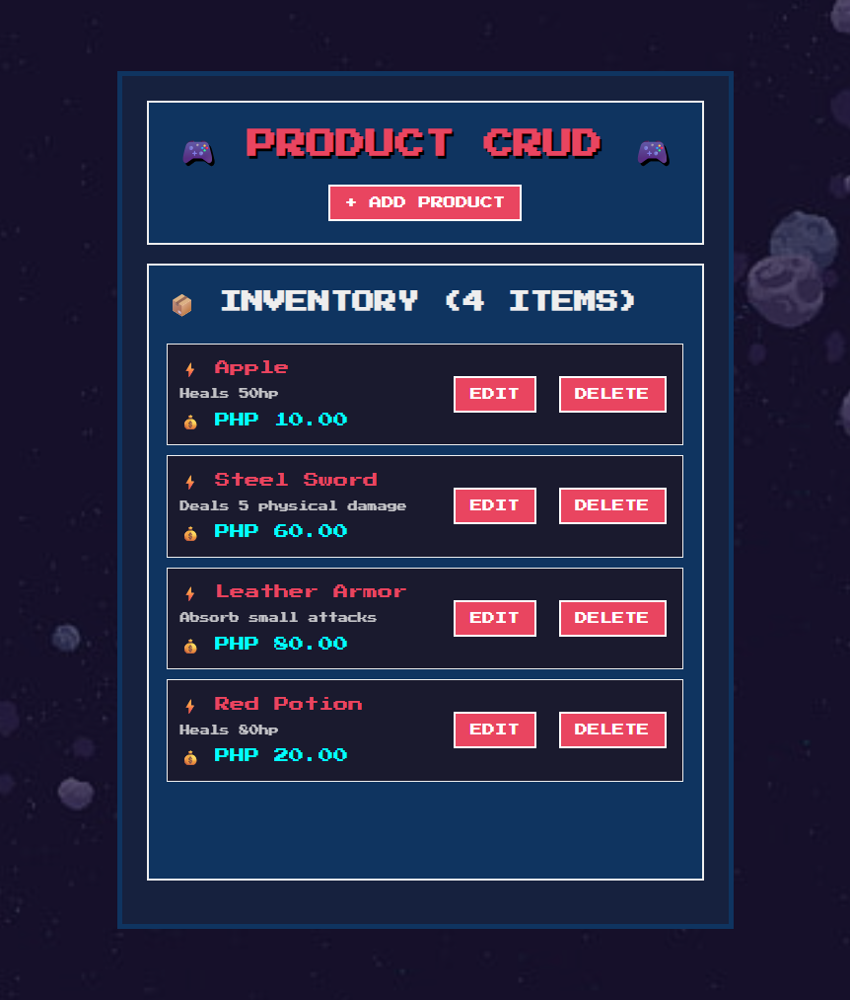

# 🎮 Retro Gaming CRUD - CodeIgniter 4

A retro pixel-style simple product management system built with CodeIgniter 4, featuring a gaming-inspired UI and interactive audio effects.

## 📸 Screenshots


*Main interface showing the retro gaming style with particle effects and product list*


## ✨ Features

- **🎨 Retro Pixel Design** - Gaming-inspired UI with Press Start 2P font
- **🎵 Interactive Audio** - Hover, success, error, and cancel sound effects
- **🖼️ Background Support** - Custom background image with opacity overlay
- **📱 Responsive Design** - Works on desktop and mobile devices
- **🔧 Full CRUD Operations** - Create, Read, Update, Delete products
- **🎯 Modal System** - Clean modal interfaces for all operations
- **🔊 Audio Feedback** - Custom audio files for user interactions

## 🚀 Technologies Used

- **Backend**: CodeIgniter 4
- **Database**: MySQL
- **Frontend**: HTML5, CSS3, JavaScript
- **Font**: Google Fonts (Press Start 2P)
- **Audio**: HTML5 Audio API
- **Animations**: CSS Keyframes & Transitions

## 📋 Prerequisites

- PHP 7.4 or higher
- MySQL 5.7 or higher
- Composer
- XAMPP/WAMP (for local development)

## 🛠️ Installation

1. **Clone the repository**
   ```bash
   git clone https://github.com/your-username/retro-gaming-crud.git
   cd retro-gaming-crud
   ```

2. **Install dependencies**
   ```bash
   composer install
   ```

3. **Environment setup**
   ```bash
   cp env .env
   ```

4. **Configure database** in `.env` file:
   ```
   database.default.hostname = localhost
   database.default.database = ci4_crud
   database.default.username = root
   database.default.password = 
   database.default.DBDriver = MySQLi
   ```

5. **Create database and run migrations**
   ```bash
   php spark migrate
   ```

6. **Start the development server**
   ```bash
   php spark serve
   ```

## 🎵 Audio Setup

Place your custom audio files in `public/assets/audio/`:
- `hover.mp3/wav` - Button hover sound
- `success.mp3/wav` - Success operation sound
- `error.mp3/wav` - Error message sound
- `cancel.mp3/wav` - Cancel/close action sound

## 🖼️ Background Image

Place your background image in `public/assets/images/background.jpg` for the retro gaming atmosphere.

## 🎮 Usage

1. Visit `http://localhost:8080` in your browser
2. Use the **+ ADD PRODUCT** button to create new products
3. **EDIT** or **DELETE** products from the inventory list
4. Enjoy the retro gaming experience with audio feedback!

## 📁 Project Structure

```
ci-4/
├── app/
│   ├── Controllers/
│   │   └── ProductController.php
│   ├── Models/
│   │   └── ProductModel.php
│   └── Views/
│       └── product_view.php
├── public/
│   └── assets/
│       ├── audio/          # Sound effects
│       └── images/         # Background images
└── database/
    └── migrations/         # Database schema
```

## 🎨 Customization

### Colors
The retro color palette can be modified in `product_view.php`:
- Primary: `#e94560` (Pink)
- Secondary: `#0f3460` (Dark Blue)
- Background: `#1a1a2e` (Dark Navy)
- Accent: `#0ff` (Cyan)

### Audio
Adjust volume levels in the JavaScript section:
```javascript
document.getElementById('successSound').volume = 0.7;
document.getElementById('hoverSound').volume = 0.3;
```

## 🤝 Contributing

1. Fork the repository
2. Create your feature branch (`git checkout -b feature/amazing-feature`)
3. Commit your changes (`git commit -m 'Add amazing feature'`)
4. Push to the branch (`git push origin feature/amazing-feature`)
5. Open a Pull Request

## 📝 License

This project is licensed under the MIT License - see the [LICENSE](LICENSE) file for details.

## 🎮 Demo

Experience the retro gaming CRUD system with:
- Pixel-perfect design elements
- Interactive audio feedback
- Smooth animations and particle effects
- Responsive gaming-style modals

## 🐛 Issues

If you encounter any issues, please create an issue on GitHub with:
- Description of the problem
- Steps to reproduce
- Expected vs actual behavior
- Browser/environment details

---

**Made with ❤️ and lots of retro gaming nostalgia** 🎮✨
